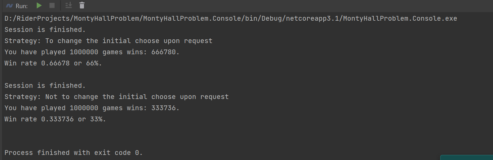

# Monty Hall Problem

The Monty Hall problem is a brain teaser, in the form of a probability puzzle, loosely based on the American television
game show Let's Make a Deal and named after its original host, Monty Hall. The problem was originally posed (and solved)
in a letter by Steve Selvin to the American Statistician in 1975. It became famous as a question from reader Craig
F. Whitaker's letter quoted in Marilyn vos Savant's "Ask Marilyn" column in Parade magazine in 1990.

## Statement of the problem

Suppose you're on a game show, and you're given the choice of three doors: Behind one door is a car; behind the others,
goats. You pick a door, say No. 1, and the host, who knows what's behind the doors, opens another door, say No. 3, which
has a goat. He then says to you, "Do you want to pick door No. 2?" Is it to your advantage to switch your choice?

## Description of the process

Given a set of doors: A, B, C.

- User chooses to open the door A, probability that car is behind the door A is **33.3(3)%**
- Chance that car is somewhere behind the rest two doors B and C is **66.6(6)%**
- Speaker (knowing what behind the door A) opens the door C, where goat is, then asks user if he wants to change his
  choose (for the moment door A)
- Since that probability that the car is somewhere behind the doors B, C is **66.6(6)%** and we know that at C there is
  no car, the probability that car is
  behind the door B is: **66.6(6)%** since that the door B accumulates the probabilities of two doors: B (itself) and the door C that
  gives **66.6(6)%** of probability in total
- Therefore, it worth to change the initial choice

## The Law of Large Numbers

According to the law, the mean value of a finite sample from a fixed distribution is close to the mathematical
expectation of this distribution.

The law of large numbers is important because it guarantees stability for the averages of some random events over a
sufficiently long series of experiments.

Therefore we are able to show that it worth to change the initial choose in case of Monty Hall problem

## Console output

